# [📈 Live Status](https://upptime.github.io/upptime): <!--live status--> **🟧 Partial outage**

This repository contains the open-source uptime monitor and status page for [Upptime](https://upptime.js.org), powered by [Upptime](https://github.com/upptime/upptime).

With [Upptime](https://upptime.js.org), you can get your own unlimited and free uptime monitor and status page, powered entirely by a GitHub repository. We use [Issues](https://github.com/upptime/upptime/issues) as incident reports, [Actions](https://github.com/aobeid96/kabistatus/actions) as uptime monitors, and [Pages](https://upptime.github.io/upptime) for the status page.

<!--start: status pages-->
<!-- This summary is generated by Upptime (https://github.com/upptime/upptime) -->
<!-- Do not edit this manually, your changes will be overwritten -->
<!-- prettier-ignore -->
| URL | Status | History | Response Time | Uptime |
| --- | ------ | ------- | ------------- | ------ |
|  [Neom](https://careers-impact.neom.com/) | 🟩 Up | [neom.yml](https://github.com/Aobeid96/kabistatus/commits/HEAD/history/neom.yml) | 

 964ms
     
 | 

<a href="https://aobeid96.github.io/kabistatus/history/neom">100.00%</a>
    

|  [Samsung](https://careers.samsungengineering-mena.com/) | 🟩 Up | [samsung.yml](https://github.com/Aobeid96/kabistatus/commits/HEAD/history/samsung.yml) | 

 974ms
     
 | 

<a href="https://aobeid96.github.io/kabistatus/history/samsung">100.00%</a>
    

|  [Samsung API](https://careers.samsungengineering-mena.com/api/health-check) | 🟩 Up | [samsung-api.yml](https://github.com/Aobeid96/kabistatus/commits/HEAD/history/samsung-api.yml) | 

 205ms
     
 | 

<a href="https://aobeid96.github.io/kabistatus/history/samsung-api">100.00%</a>
    

|  [Coolinc](https://careers.coolinc.com.sa/) | 🟩 Up | [coolinc.yml](https://github.com/Aobeid96/kabistatus/commits/HEAD/history/coolinc.yml) | 

 1136ms
     
 | 

<a href="https://aobeid96.github.io/kabistatus/history/coolinc">100.00%</a>
    

|  [Coolinc API](https://careers.coolinc.com.sa/api/health-check) | 🟩 Up | [coolinc-api.yml](https://github.com/Aobeid96/kabistatus/commits/HEAD/history/coolinc-api.yml) | 

 179ms
     
 | 

<a href="https://aobeid96.github.io/kabistatus/history/coolinc-api">100.00%</a>
    

|  [SNB](https://career.alahlicapital.com/) | 🟩 Up | [snb.yml](https://github.com/Aobeid96/kabistatus/commits/HEAD/history/snb.yml) | 

 1467ms
     
 | 

<a href="https://aobeid96.github.io/kabistatus/history/snb">100.00%</a>
    

|  [SNB API](https://career.alahlicapital.com/api/health-check) | 🟩 Up | [snb-api.yml](https://github.com/Aobeid96/kabistatus/commits/HEAD/history/snb-api.yml) | 

 178ms
     
 | 

<a href="https://aobeid96.github.io/kabistatus/history/snb-api">100.00%</a>
    

|  [Flynas](https://career.flynas.com/) | 🟩 Up | [flynas.yml](https://github.com/Aobeid96/kabistatus/commits/HEAD/history/flynas.yml) | 

 834ms
     
 | 

<a href="https://aobeid96.github.io/kabistatus/history/flynas">100.00%</a>
    

|  [Flynas API](https://career.flynas.com/api/health-check) | 🟩 Up | [flynas-api.yml](https://github.com/Aobeid96/kabistatus/commits/HEAD/history/flynas-api.yml) | 

 177ms
     
 | 

<a href="https://aobeid96.github.io/kabistatus/history/flynas-api">100.00%</a>
    

|  [MOS](https://career.mos.gov.sa/) | 🟩 Up | [mos.yml](https://github.com/Aobeid96/kabistatus/commits/HEAD/history/mos.yml) | 

 860ms
     
 | 

<a href="https://aobeid96.github.io/kabistatus/history/mos">100.00%</a>
    

|  [MOS API](https://career.mos.gov.sa/api/health-check) | 🟩 Up | [mos-api.yml](https://github.com/Aobeid96/kabistatus/commits/HEAD/history/mos-api.yml) | 

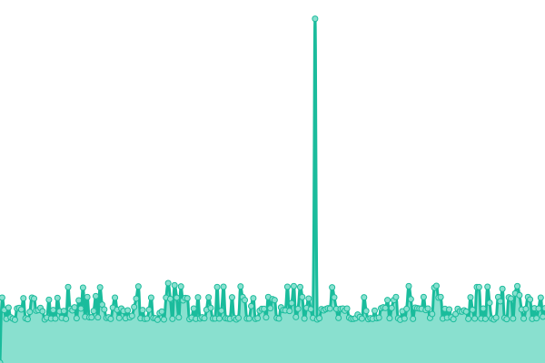 176ms
     
 | 

<a href="https://aobeid96.github.io/kabistatus/history/mos-api">100.00%</a>
    

|  [alssef](https://careers.alseef-hospital.com/) | 🟩 Up | [alssef.yml](https://github.com/Aobeid96/kabistatus/commits/HEAD/history/alssef.yml) | 

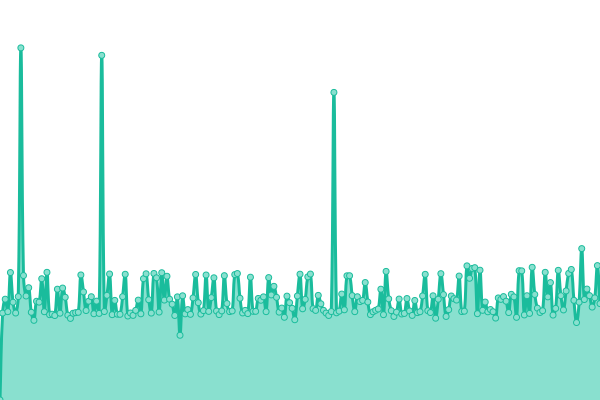 1580ms
     
 | 

<a href="https://aobeid96.github.io/kabistatus/history/alssef">100.00%</a>
    

|  [alssef API](https://careers.alseef-hospital.com/api/health-check) | 🟩 Up | [alssef-api.yml](https://github.com/Aobeid96/kabistatus/commits/HEAD/history/alssef-api.yml) | 

 207ms
     
 | 

<a href="https://aobeid96.github.io/kabistatus/history/alssef-api">100.00%</a>
    

|  [FTA](https://career.fta.prod.hyrdd.io/) | 🟩 Up | [fta.yml](https://github.com/Aobeid96/kabistatus/commits/HEAD/history/fta.yml) | 

 884ms
     
 | 

<a href="https://aobeid96.github.io/kabistatus/history/fta">100.00%</a>
    

|  [FTA API](https://career.fta.prod.hyrdd.io/api/health-check) | 🟩 Up | [fta-api.yml](https://github.com/Aobeid96/kabistatus/commits/HEAD/history/fta-api.yml) | 

 207ms
     
 | 

<a href="https://aobeid96.github.io/kabistatus/history/fta-api">100.00%</a>
    

|  [Ghadeer](https://ghadeer.tech/) | 🟩 Up | [ghadeer.yml](https://github.com/Aobeid96/kabistatus/commits/HEAD/history/ghadeer.yml) | 

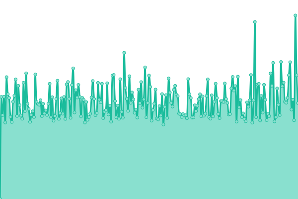 962ms
     
 | 

<a href="https://aobeid96.github.io/kabistatus/history/ghadeer">100.00%</a>
    

|  [Ghadeer API](https://ghadeer.tech/api/health-check) | 🟩 Up | [ghadeer-api.yml](https://github.com/Aobeid96/kabistatus/commits/HEAD/history/ghadeer-api.yml) | 

 207ms
     
 | 

<a href="https://aobeid96.github.io/kabistatus/history/ghadeer-api">100.00%</a>
    

|  [Marakez](https://careers.marakez.net/) | 🟩 Up | [marakez.yml](https://github.com/Aobeid96/kabistatus/commits/HEAD/history/marakez.yml) | 

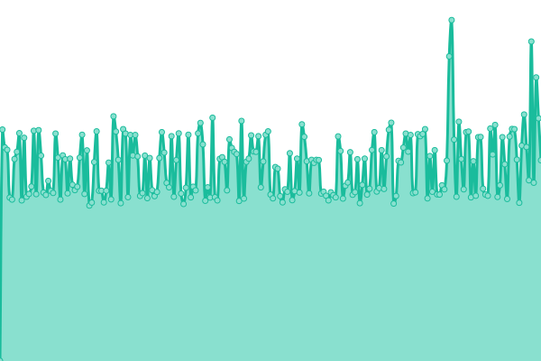 955ms
     
 | 

<a href="https://aobeid96.github.io/kabistatus/history/marakez">100.00%</a>
    

|  [Marakez API](https://careers.marakez.net/api/health-check) | 🟩 Up | [marakez-api.yml](https://github.com/Aobeid96/kabistatus/commits/HEAD/history/marakez-api.yml) | 

 208ms
     
 | 

<a href="https://aobeid96.github.io/kabistatus/history/marakez-api">100.00%</a>
    

|  [MLS](https://careers.mls-egypt.org/) | 🟩 Up | [mls.yml](https://github.com/Aobeid96/kabistatus/commits/HEAD/history/mls.yml) | 

 1046ms
     
 | 

<a href="https://aobeid96.github.io/kabistatus/history/mls">100.00%</a>
    

|  [MLS API](https://careers.mls-egypt.org/api/health-check) | 🟩 Up | [mls-api.yml](https://github.com/Aobeid96/kabistatus/commits/HEAD/history/mls-api.yml) | 

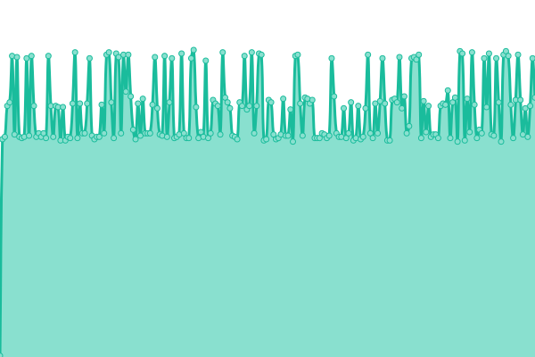 205ms
     
 | 

<a href="https://aobeid96.github.io/kabistatus/history/mls-api">100.00%</a>
    

|  [Estiqtab](https://estiqtab.hyrddbh.com/) | 🟩 Up | [estiqtab.yml](https://github.com/Aobeid96/kabistatus/commits/HEAD/history/estiqtab.yml) | 

 915ms
     
 | 

<a href="https://aobeid96.github.io/kabistatus/history/estiqtab">100.00%</a>
    

|  [Estiqtab API](https://estiqtab.hyrddbh.com/api/health-check) | 🟩 Up | [estiqtab-api.yml](https://github.com/Aobeid96/kabistatus/commits/HEAD/history/estiqtab-api.yml) | 

 208ms
     
 | 

<a href="https://aobeid96.github.io/kabistatus/history/estiqtab-api">100.00%</a>
    

|  [WizHRD](https://jobs.wizhrd.co/) | 🟩 Up | [wiz-hrd.yml](https://github.com/Aobeid96/kabistatus/commits/HEAD/history/wiz-hrd.yml) | 

 939ms
     
 | 

<a href="https://aobeid96.github.io/kabistatus/history/wiz-hrd">100.00%</a>
    

|  [WizHRD API](https://jobs.wizhrd.co/api/health-check) | 🟩 Up | [wiz-hrd-api.yml](https://github.com/Aobeid96/kabistatus/commits/HEAD/history/wiz-hrd-api.yml) | 

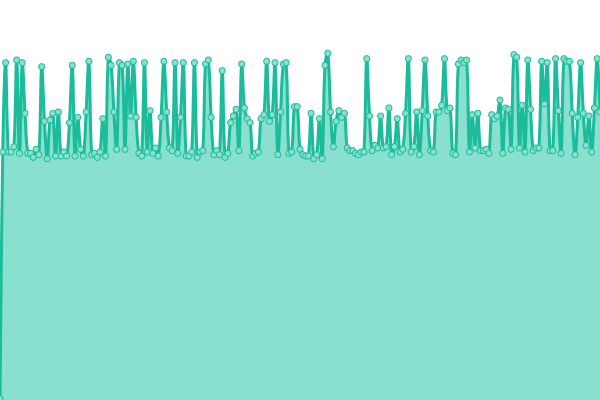 204ms
     
 | 

<a href="https://aobeid96.github.io/kabistatus/history/wiz-hrd-api">100.00%</a>
    

|  [ARO](https://career.aro.jeddah.hyrdd.io/) | 🟩 Up | [aro.yml](https://github.com/Aobeid96/kabistatus/commits/HEAD/history/aro.yml) | 

 748ms
     
 | 

<a href="https://aobeid96.github.io/kabistatus/history/aro">100.00%</a>
    

|  [ARO API](https://career.aro.jeddah.hyrdd.io/api/health-check) | 🟩 Up | [aro-api.yml](https://github.com/Aobeid96/kabistatus/commits/HEAD/history/aro-api.yml) | 

 174ms
     
 | 

<a href="https://aobeid96.github.io/kabistatus/history/aro-api">100.00%</a>
    

|  [Jacrijkm](https://careers.jacrijk-alrushaid.com/) | 🟩 Up | [jacrijkm.yml](https://github.com/Aobeid96/kabistatus/commits/HEAD/history/jacrijkm.yml) | 

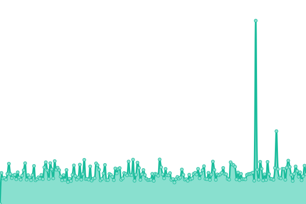 846ms
     
 | 

<a href="https://aobeid96.github.io/kabistatus/history/jacrijkm">100.00%</a>
    

|  [Jacrijkm API](https://careers.jacrijk-alrushaid.com/api/health-check) | 🟩 Up | [jacrijkm-api.yml](https://github.com/Aobeid96/kabistatus/commits/HEAD/history/jacrijkm-api.yml) | 

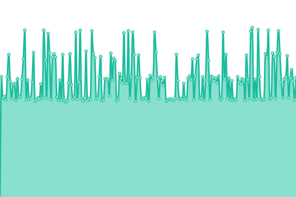 168ms
     
 | 

<a href="https://aobeid96.github.io/kabistatus/history/jacrijkm-api">100.00%</a>
    

|  [Esnadalriyadm](https://esnadalriyadm.hyrddsa.com/) | 🟩 Up | [esnadalriyadm.yml](https://github.com/Aobeid96/kabistatus/commits/HEAD/history/esnadalriyadm.yml) | 

 734ms
     
 | 

<a href="https://aobeid96.github.io/kabistatus/history/esnadalriyadm">100.00%</a>
    

|  [Esnadalriyadm API](https://esnadalriyadm.hyrddsa.com/api/health-check) | 🟩 Up | [esnadalriyadm-api.yml](https://github.com/Aobeid96/kabistatus/commits/HEAD/history/esnadalriyadm-api.yml) | 

 171ms
     
 | 

<a href="https://aobeid96.github.io/kabistatus/history/esnadalriyadm-api">100.00%</a>
    

|  [domty](https://domty.hyrddbh.com/) | 🟩 Up | [domty.yml](https://github.com/Aobeid96/kabistatus/commits/HEAD/history/domty.yml) | 

 869ms
     
 | 

<a href="https://aobeid96.github.io/kabistatus/history/domty">100.00%</a>
    

|  [domty API](https://domty.hyrddbh.com/api/health-check) | 🟩 Up | [domty-api.yml](https://github.com/Aobeid96/kabistatus/commits/HEAD/history/domty-api.yml) | 

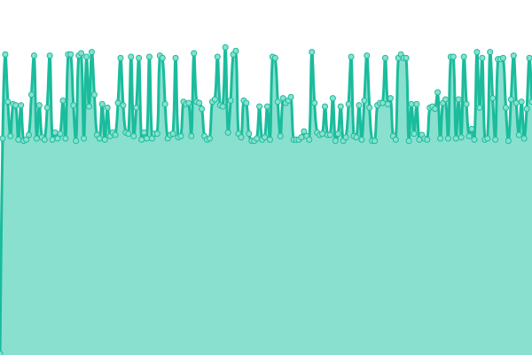 206ms
     
 | 

<a href="https://aobeid96.github.io/kabistatus/history/domty-api">100.00%</a>
    

|  [nits](https://ntis.hyrddsa.com/) | 🟥 Down | [nits.yml](https://github.com/Aobeid96/kabistatus/commits/HEAD/history/nits.yml) | 

 559ms
     
 | 

<a href="https://aobeid96.github.io/kabistatus/history/nits">0.29%</a>
    

|  [nits API](https://ntis.hyrddsa.com/api/health-check) | 🟥 Down | [nits-api.yml](https://github.com/Aobeid96/kabistatus/commits/HEAD/history/nits-api.yml) | 

 171ms
     
 | 

<a href="https://aobeid96.github.io/kabistatus/history/nits-api">0.06%</a>
    

|  [taqa](https://taqa.hyrddsa.com/) | 🟩 Up | [taqa.yml](https://github.com/Aobeid96/kabistatus/commits/HEAD/history/taqa.yml) | 

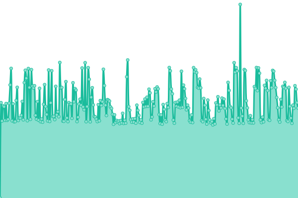 701ms
     
 | 

<a href="https://aobeid96.github.io/kabistatus/history/taqa">100.00%</a>
    

|  [taqa API](https://taqa.hyrddsa.com/api/health-check) | 🟩 Up | [taqa-api.yml](https://github.com/Aobeid96/kabistatus/commits/HEAD/history/taqa-api.yml) | 

 164ms
     
 | 

<a href="https://aobeid96.github.io/kabistatus/history/taqa-api">100.00%</a>
    

|  [london](https://london.hyrdd.io/) | 🟩 Up | [london.yml](https://github.com/Aobeid96/kabistatus/commits/HEAD/history/london.yml) | 

 737ms
     
 | 

<a href="https://aobeid96.github.io/kabistatus/history/london">100.00%</a>
    

|  [london API](https://london.hyrdd.io/api/health-check) | 🟩 Up | [london-api.yml](https://github.com/Aobeid96/kabistatus/commits/HEAD/history/london-api.yml) | 

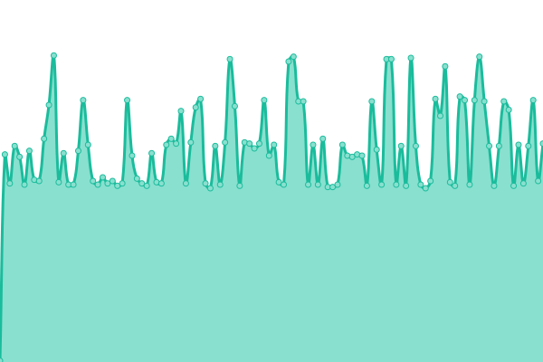 163ms
     
 | 

<a href="https://aobeid96.github.io/kabistatus/history/london-api">100.00%</a>
    

|  [tokyo](https://tokyo.hyrdd.io/) | 🟩 Up | [tokyo.yml](https://github.com/Aobeid96/kabistatus/commits/HEAD/history/tokyo.yml) | 

 736ms
     
 | 

<a href="https://aobeid96.github.io/kabistatus/history/tokyo">100.00%</a>
    

|  [tokyo API](https://tokyo.hyrdd.io/api/health-check) | 🟩 Up | [tokyo-api.yml](https://github.com/Aobeid96/kabistatus/commits/HEAD/history/tokyo-api.yml) | 

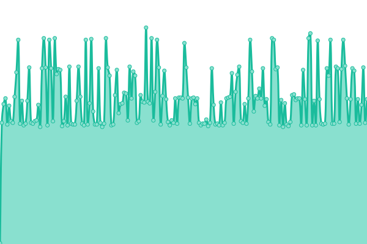 162ms
     
 | 

<a href="https://aobeid96.github.io/kabistatus/history/tokyo-api">100.00%</a>
    

|  [rio](https://rio.hyrdd.io/) | 🟩 Up | [rio.yml](https://github.com/Aobeid96/kabistatus/commits/HEAD/history/rio.yml) | 

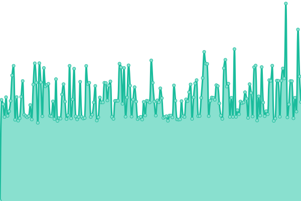 748ms
     
 | 

<a href="https://aobeid96.github.io/kabistatus/history/rio">100.00%</a>
    

|  [rio API](https://rio.hyrdd.io/api/health-check) | 🟩 Up | [rio-api.yml](https://github.com/Aobeid96/kabistatus/commits/HEAD/history/rio-api.yml) | 

 167ms
     
 | 

<a href="https://aobeid96.github.io/kabistatus/history/rio-api">100.00%</a>
    

|  [berlin](https://berlin.hyrdd.io/) | 🟩 Up | [berlin.yml](https://github.com/Aobeid96/kabistatus/commits/HEAD/history/berlin.yml) | 

 740ms
     
 | 

<a href="https://aobeid96.github.io/kabistatus/history/berlin">100.00%</a>
    

|  [berlin API](https://rio.hyrdd.io/api/health-check) | 🟩 Up | [berlin-api.yml](https://github.com/Aobeid96/kabistatus/commits/HEAD/history/berlin-api.yml) | 

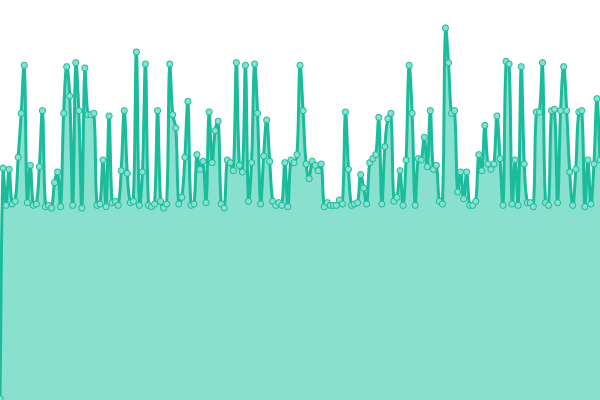 160ms
     
 | 

<a href="https://aobeid96.github.io/kabistatus/history/berlin-api">100.00%</a>
    

|  [tabukpharmaceuticals](https://tabukpharmaceuticals.hyrddsa.com/) | 🟩 Up | [tabukpharmaceuticals.yml](https://github.com/Aobeid96/kabistatus/commits/HEAD/history/tabukpharmaceuticals.yml) | 

 624ms
     
 | 

<a href="https://aobeid96.github.io/kabistatus/history/tabukpharmaceuticals">100.00%</a>
    

|  [tabukpharmaceuticals API](https://tabukpharmaceuticals.hyrddsa.com/api/health-check) | 🟩 Up | [tabukpharmaceuticals-api.yml](https://github.com/Aobeid96/kabistatus/commits/HEAD/history/tabukpharmaceuticals-api.yml) | 

 148ms
     
 | 

<a href="https://aobeid96.github.io/kabistatus/history/tabukpharmaceuticals-api">100.00%</a>
    

<!--end: status pages-->

[**Visit our status website →**](https://upptime.github.io/upptime)

## 📄 License

- Powered by: [Upptime](https://github.com/upptime/upptime)
- Code: [MIT](./LICENSE) © [Upptime](https://upptime.js.org)
- Data in the `./history` directory: [Open Database License](https://opendatacommons.org/licenses/odbl/1-0/)
