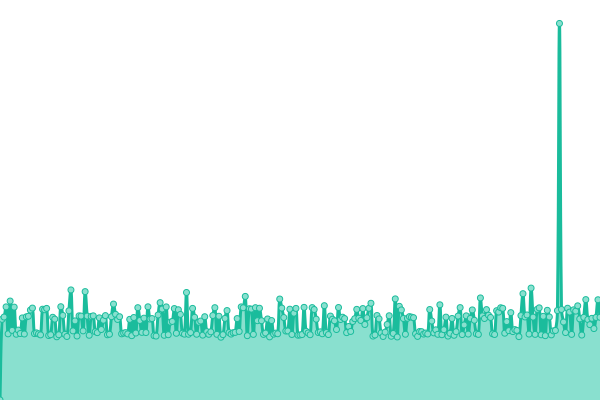
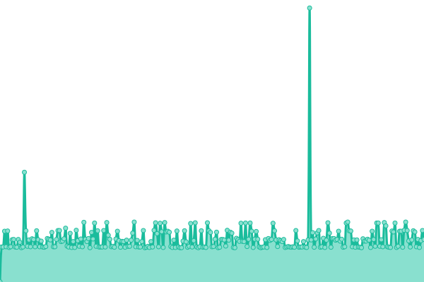
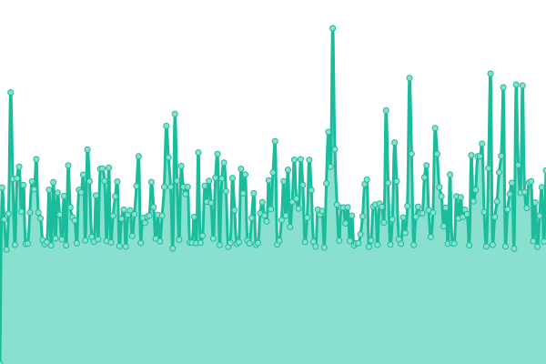

# [📈 Live Status](https://upptime.github.io/upptime): <!--live status--> **🟩 All systems operational**

This repository contains the open-source uptime monitor and status page for [Upptime](https://upptime.js.org), powered by [Upptime](https://github.com/upptime/upptime).

With [Upptime](https://upptime.js.org), you can get your own unlimited and free uptime monitor and status page, powered entirely by a GitHub repository. We use [Issues](https://github.com/upptime/upptime/issues) as incident reports, [Actions](https://github.com/aobeid96/kabistatus/actions) as uptime monitors, and [Pages](https://upptime.github.io/upptime) for the status page.

<!--start: status pages-->
<!-- This summary is generated by Upptime (https://github.com/upptime/upptime) -->
<!-- Do not edit this manually, your changes will be overwritten -->
<!-- prettier-ignore -->
| URL | Status | History | Response Time | Uptime |
| --- | ------ | ------- | ------------- | ------ |
|  [Neom](https://careers-impact.neom.com/) | 🟩 Up | [neom.yml](https://github.com/Aobeid96/kabistatus/commits/HEAD/history/neom.yml) | 

 966ms
     
 | 

<a href="https://aobeid96.github.io/kabistatus/history/neom">100.00%</a>
    

|  [Samsung](https://careers.samsungengineering-mena.com/) | 🟩 Up | [samsung.yml](https://github.com/Aobeid96/kabistatus/commits/HEAD/history/samsung.yml) | 

 982ms
     
 | 

<a href="https://aobeid96.github.io/kabistatus/history/samsung">100.00%</a>
    

|  [Samsung API](https://careers.samsungengineering-mena.com/api/health-check) | 🟩 Up | [samsung-api.yml](https://github.com/Aobeid96/kabistatus/commits/HEAD/history/samsung-api.yml) | 

 205ms
     
 | 

<a href="https://aobeid96.github.io/kabistatus/history/samsung-api">100.00%</a>
    

|  [Coolinc](https://careers.coolinc.com.sa/) | 🟩 Up | [coolinc.yml](https://github.com/Aobeid96/kabistatus/commits/HEAD/history/coolinc.yml) | 

 1162ms
     
 | 

<a href="https://aobeid96.github.io/kabistatus/history/coolinc">100.00%</a>
    

|  [Coolinc API](https://careers.coolinc.com.sa/api/health-check) | 🟩 Up | [coolinc-api.yml](https://github.com/Aobeid96/kabistatus/commits/HEAD/history/coolinc-api.yml) | 

 179ms
     
 | 

<a href="https://aobeid96.github.io/kabistatus/history/coolinc-api">100.00%</a>
    

|  [SNB](https://career.alahlicapital.com/) | 🟩 Up | [snb.yml](https://github.com/Aobeid96/kabistatus/commits/HEAD/history/snb.yml) | 

 1467ms
     
 | 

<a href="https://aobeid96.github.io/kabistatus/history/snb">100.00%</a>
    

|  [SNB API](https://career.alahlicapital.com/api/health-check) | 🟩 Up | [snb-api.yml](https://github.com/Aobeid96/kabistatus/commits/HEAD/history/snb-api.yml) | 

 178ms
     
 | 

<a href="https://aobeid96.github.io/kabistatus/history/snb-api">100.00%</a>
    

|  [Flynas](https://career.flynas.com/) | 🟩 Up | [flynas.yml](https://github.com/Aobeid96/kabistatus/commits/HEAD/history/flynas.yml) | 

 853ms
     
 | 

<a href="https://aobeid96.github.io/kabistatus/history/flynas">100.00%</a>
    

|  [Flynas API](https://career.flynas.com/api/health-check) | 🟩 Up | [flynas-api.yml](https://github.com/Aobeid96/kabistatus/commits/HEAD/history/flynas-api.yml) | 

 176ms
     
 | 

<a href="https://aobeid96.github.io/kabistatus/history/flynas-api">100.00%</a>
    

|  [MOS](https://career.mos.gov.sa/) | 🟩 Up | [mos.yml](https://github.com/Aobeid96/kabistatus/commits/HEAD/history/mos.yml) | 

 910ms
     
 | 

<a href="https://aobeid96.github.io/kabistatus/history/mos">100.00%</a>
    

|  [MOS API](https://career.mos.gov.sa/api/health-check) | 🟩 Up | [mos-api.yml](https://github.com/Aobeid96/kabistatus/commits/HEAD/history/mos-api.yml) | 

 175ms
     
 | 

<a href="https://aobeid96.github.io/kabistatus/history/mos-api">100.00%</a>
    

<!--end: status pages-->

[**Visit our status website →**](https://upptime.github.io/upptime)

## 📄 License

- Powered by: [Upptime](https://github.com/upptime/upptime)
- Code: [MIT](./LICENSE) © [Upptime](https://upptime.js.org)
- Data in the `./history` directory: [Open Database License](https://opendatacommons.org/licenses/odbl/1-0/)
