# [游늳 Live Status](https://upptime.github.io/upptime): <!--live status--> **游릲 Partial outage**

This repository contains the open-source uptime monitor and status page for [Upptime](https://upptime.js.org), powered by [Upptime](https://github.com/upptime/upptime).

With [Upptime](https://upptime.js.org), you can get your own unlimited and free uptime monitor and status page, powered entirely by a GitHub repository. We use [Issues](https://github.com/upptime/upptime/issues) as incident reports, [Actions](https://github.com/aobeid96/kabistatus/actions) as uptime monitors, and [Pages](https://upptime.github.io/upptime) for the status page.

<!--start: status pages-->
<!-- This summary is generated by Upptime (https://github.com/upptime/upptime) -->
<!-- Do not edit this manually, your changes will be overwritten -->
<!-- prettier-ignore -->
| URL | Status | History | Response Time | Uptime |
| --- | ------ | ------- | ------------- | ------ |
|  [Neom](https://careers-impact.neom.com/) | 游릴 Up | [neom.yml](https://github.com/Aobeid96/kabistatus/commits/HEAD/history/neom.yml) | 

 965ms
     
 | 

<a href="https://status.kabi.ai/history/neom">100.00%</a>
    

|  [Samsung](https://careers.samsungengineering-mena.com/) | 游릴 Up | [samsung.yml](https://github.com/Aobeid96/kabistatus/commits/HEAD/history/samsung.yml) | 

 967ms
     
 | 

<a href="https://status.kabi.ai/history/samsung">97.20%</a>
    

|  [Samsung API](https://careers.samsungengineering-mena.com/api/health-check) | 游릴 Up | [samsung-api.yml](https://github.com/Aobeid96/kabistatus/commits/HEAD/history/samsung-api.yml) | 

 207ms
     
 | 

<a href="https://status.kabi.ai/history/samsung-api">100.00%</a>
    

|  [Coolinc](https://careers.coolinc.com.sa/) | 游릴 Up | [coolinc.yml](https://github.com/Aobeid96/kabistatus/commits/HEAD/history/coolinc.yml) | 

 1120ms
     
 | 

<a href="https://status.kabi.ai/history/coolinc">100.00%</a>
    

|  [Coolinc API](https://careers.coolinc.com.sa/api/health-check) | 游릴 Up | [coolinc-api.yml](https://github.com/Aobeid96/kabistatus/commits/HEAD/history/coolinc-api.yml) | 

 183ms
     
 | 

<a href="https://status.kabi.ai/history/coolinc-api">100.00%</a>
    

|  [SNB](https://career.alahlicapital.com/) | 游릴 Up | [snb.yml](https://github.com/Aobeid96/kabistatus/commits/HEAD/history/snb.yml) | 

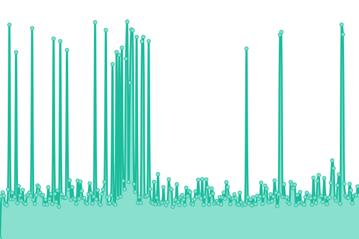 1503ms
     
 | 

<a href="https://status.kabi.ai/history/snb">100.00%</a>
    

|  [SNB API](https://career.alahlicapital.com/api/health-check) | 游릴 Up | [snb-api.yml](https://github.com/Aobeid96/kabistatus/commits/HEAD/history/snb-api.yml) | 

 178ms
     
 | 

<a href="https://status.kabi.ai/history/snb-api">100.00%</a>
    

|  [Flynas](https://career.flynas.com/) | 游릴 Up | [flynas.yml](https://github.com/Aobeid96/kabistatus/commits/HEAD/history/flynas.yml) | 

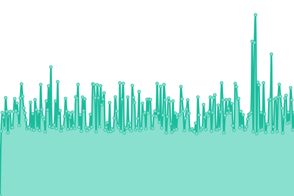 837ms
     
 | 

<a href="https://status.kabi.ai/history/flynas">100.00%</a>
    

|  [Flynas API](https://career.flynas.com/api/health-check) | 游릴 Up | [flynas-api.yml](https://github.com/Aobeid96/kabistatus/commits/HEAD/history/flynas-api.yml) | 

 182ms
     
 | 

<a href="https://status.kabi.ai/history/flynas-api">100.00%</a>
    

|  [MOS](https://career.mos.gov.sa/) | 游릴 Up | [mos.yml](https://github.com/Aobeid96/kabistatus/commits/HEAD/history/mos.yml) | 

 873ms
     
 | 

<a href="https://status.kabi.ai/history/mos">100.00%</a>
    

|  [MOS API](https://career.mos.gov.sa/api/health-check) | 游릴 Up | [mos-api.yml](https://github.com/Aobeid96/kabistatus/commits/HEAD/history/mos-api.yml) | 

 183ms
     
 | 

<a href="https://status.kabi.ai/history/mos-api">99.87%</a>
    

|  [Alssef](https://careers.alseef-hospital.com/) | 游릴 Up | [alssef.yml](https://github.com/Aobeid96/kabistatus/commits/HEAD/history/alssef.yml) | 

 1542ms
     
 | 

<a href="https://status.kabi.ai/history/alssef">97.48%</a>
    

|  [Alssef API](https://careers.alseef-hospital.com/api/health-check) | 游릴 Up | [alssef-api.yml](https://github.com/Aobeid96/kabistatus/commits/HEAD/history/alssef-api.yml) | 

 208ms
     
 | 

<a href="https://status.kabi.ai/history/alssef-api">97.48%</a>
    

|  [FTA](https://fta.federaljobs.gov.ae/) | 游릴 Up | [fta.yml](https://github.com/Aobeid96/kabistatus/commits/HEAD/history/fta.yml) | 

 959ms
     
 | 

<a href="https://status.kabi.ai/history/fta">100.00%</a>
    

|  [Ghadeer](https://ghadeer.tech/) | 游릴 Up | [ghadeer.yml](https://github.com/Aobeid96/kabistatus/commits/HEAD/history/ghadeer.yml) | 

 969ms
     
 | 

<a href="https://status.kabi.ai/history/ghadeer">100.00%</a>
    

|  [Ghadeer API](https://ghadeer.tech/api/health-check) | 游릴 Up | [ghadeer-api.yml](https://github.com/Aobeid96/kabistatus/commits/HEAD/history/ghadeer-api.yml) | 

 207ms
     
 | 

<a href="https://status.kabi.ai/history/ghadeer-api">100.00%</a>
    

|  [Marakez](https://careers.marakez.net/) | 游릴 Up | [marakez.yml](https://github.com/Aobeid96/kabistatus/commits/HEAD/history/marakez.yml) | 

 954ms
     
 | 

<a href="https://status.kabi.ai/history/marakez">100.00%</a>
    

|  [Marakez API](https://careers.marakez.net/api/health-check) | 游릴 Up | [marakez-api.yml](https://github.com/Aobeid96/kabistatus/commits/HEAD/history/marakez-api.yml) | 

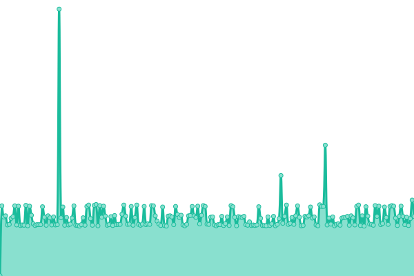 213ms
     
 | 

<a href="https://status.kabi.ai/history/marakez-api">100.00%</a>
    

|  [MLS](https://careers.mls-egypt.org/) | 游릴 Up | [mls.yml](https://github.com/Aobeid96/kabistatus/commits/HEAD/history/mls.yml) | 

 1048ms
     
 | 

<a href="https://status.kabi.ai/history/mls">100.00%</a>
    

|  [MLS API](https://careers.mls-egypt.org/api/health-check) | 游릴 Up | [mls-api.yml](https://github.com/Aobeid96/kabistatus/commits/HEAD/history/mls-api.yml) | 

 207ms
     
 | 

<a href="https://status.kabi.ai/history/mls-api">100.00%</a>
    

|  [Estiqtab Cluster](https://estiqtab.hyrddbh.com/) | 游릴 Up | [estiqtab-cluster.yml](https://github.com/Aobeid96/kabistatus/commits/HEAD/history/estiqtab-cluster.yml) | 

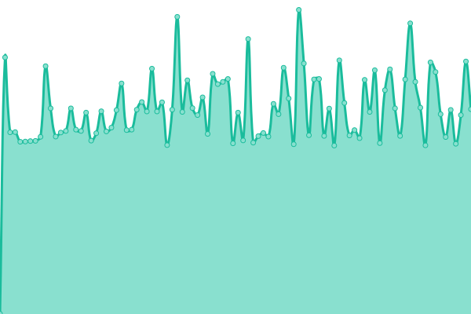 889ms
     
 | 

<a href="https://status.kabi.ai/history/estiqtab-cluster">100.00%</a>
    

|  [Estiqtab Cluster API](https://estiqtab.hyrddbh.com/api/health-check) | 游릴 Up | [estiqtab-cluster-api.yml](https://github.com/Aobeid96/kabistatus/commits/HEAD/history/estiqtab-cluster-api.yml) | 

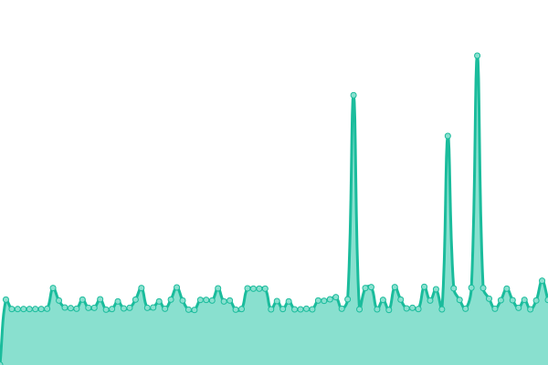 201ms
     
 | 

<a href="https://status.kabi.ai/history/estiqtab-cluster-api">100.00%</a>
    

|  [Federaljobs](https://federaljobs.gov.ae/) | 游릴 Up | [federaljobs.yml](https://github.com/Aobeid96/kabistatus/commits/HEAD/history/federaljobs.yml) | 

 1527ms
     
 | 

<a href="https://status.kabi.ai/history/federaljobs">100.00%</a>
    

|  [Federaljobs API](https://federaljobs.gov.ae/api/health-check) | 游린 Down | [federaljobs-api.yml](https://github.com/Aobeid96/kabistatus/commits/HEAD/history/federaljobs-api.yml) | 

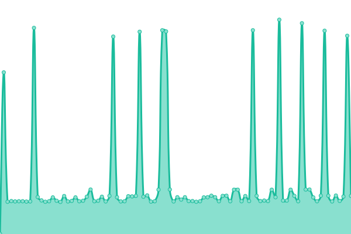 299ms
     
 | 

<a href="https://status.kabi.ai/history/federaljobs-api">98.36%</a>
    

|  [WizHRD](https://jobs.wizhrd.co/) | 游릴 Up | [wiz-hrd.yml](https://github.com/Aobeid96/kabistatus/commits/HEAD/history/wiz-hrd.yml) | 

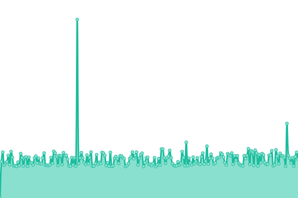 983ms
     
 | 

<a href="https://status.kabi.ai/history/wiz-hrd">100.00%</a>
    

|  [WizHRD API](https://jobs.wizhrd.co/api/health-check) | 游릴 Up | [wiz-hrd-api.yml](https://github.com/Aobeid96/kabistatus/commits/HEAD/history/wiz-hrd-api.yml) | 

 207ms
     
 | 

<a href="https://status.kabi.ai/history/wiz-hrd-api">100.00%</a>
    

|  [ARO](https://career.aro.jeddah.hyrdd.io/) | 游릴 Up | [aro.yml](https://github.com/Aobeid96/kabistatus/commits/HEAD/history/aro.yml) | 

 768ms
     
 | 

<a href="https://status.kabi.ai/history/aro">100.00%</a>
    

|  [ARO API](https://career.aro.jeddah.hyrdd.io/api/health-check) | 游릴 Up | [aro-api.yml](https://github.com/Aobeid96/kabistatus/commits/HEAD/history/aro-api.yml) | 

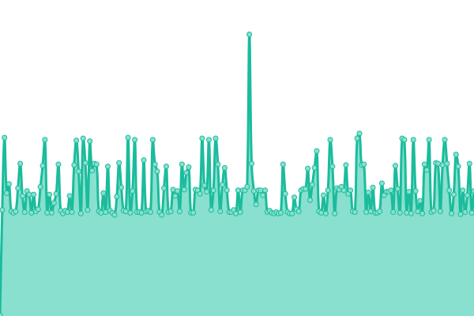 179ms
     
 | 

<a href="https://status.kabi.ai/history/aro-api">100.00%</a>
    

|  [Jacrijkm](https://careers.jacrijk-alrushaid.com/) | 游릴 Up | [jacrijkm.yml](https://github.com/Aobeid96/kabistatus/commits/HEAD/history/jacrijkm.yml) | 

 872ms
     
 | 

<a href="https://status.kabi.ai/history/jacrijkm">99.06%</a>
    

|  [Jacrijkm API](https://careers.jacrijk-alrushaid.com/api/health-check) | 游릴 Up | [jacrijkm-api.yml](https://github.com/Aobeid96/kabistatus/commits/HEAD/history/jacrijkm-api.yml) | 

 177ms
     
 | 

<a href="https://status.kabi.ai/history/jacrijkm-api">93.71%</a>
    

|  [Esnadalriyadm](https://esnadalriyadm.hyrddsa.com/) | 游릴 Up | [esnadalriyadm.yml](https://github.com/Aobeid96/kabistatus/commits/HEAD/history/esnadalriyadm.yml) | 

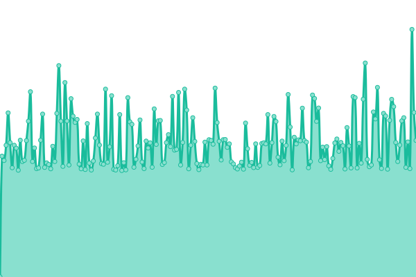 769ms
     
 | 

<a href="https://status.kabi.ai/history/esnadalriyadm">100.00%</a>
    

|  [Esnadalriyadm API](https://esnadalriyadm.hyrddsa.com/api/health-check) | 游릴 Up | [esnadalriyadm-api.yml](https://github.com/Aobeid96/kabistatus/commits/HEAD/history/esnadalriyadm-api.yml) | 

 178ms
     
 | 

<a href="https://status.kabi.ai/history/esnadalriyadm-api">100.00%</a>
    

|  [domty](https://domty.hyrddbh.com/) | 游릴 Up | [domty.yml](https://github.com/Aobeid96/kabistatus/commits/HEAD/history/domty.yml) | 

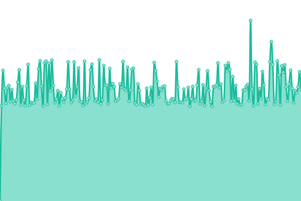 881ms
     
 | 

<a href="https://status.kabi.ai/history/domty">100.00%</a>
    

|  [domty API](https://domty.hyrddbh.com/api/health-check) | 游릴 Up | [domty-api.yml](https://github.com/Aobeid96/kabistatus/commits/HEAD/history/domty-api.yml) | 

 206ms
     
 | 

<a href="https://status.kabi.ai/history/domty-api">100.00%</a>
    

|  [nits](https://career.ntis.com.sa/) | 游릴 Up | [nits.yml](https://github.com/Aobeid96/kabistatus/commits/HEAD/history/nits.yml) | 

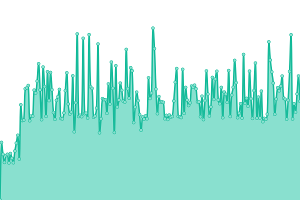 1219ms
     
 | 

<a href="https://status.kabi.ai/history/nits">96.12%</a>
    

|  [nits API](https://career.ntis.com.sa/api/health-check) | 游릴 Up | [nits-api.yml](https://github.com/Aobeid96/kabistatus/commits/HEAD/history/nits-api.yml) | 

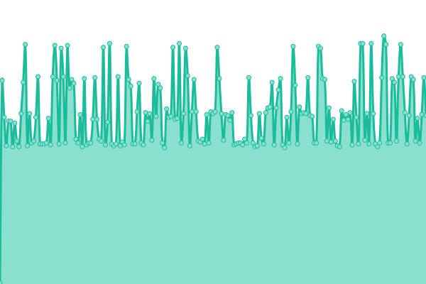 178ms
     
 | 

<a href="https://status.kabi.ai/history/nits-api">96.12%</a>
    

|  [taqa](https://taqa.hyrddsa.com/) | 游릴 Up | [taqa.yml](https://github.com/Aobeid96/kabistatus/commits/HEAD/history/taqa.yml) | 

 751ms
     
 | 

<a href="https://status.kabi.ai/history/taqa">100.00%</a>
    

|  [taqa API](https://taqa.hyrddsa.com/api/health-check) | 游릴 Up | [taqa-api.yml](https://github.com/Aobeid96/kabistatus/commits/HEAD/history/taqa-api.yml) | 

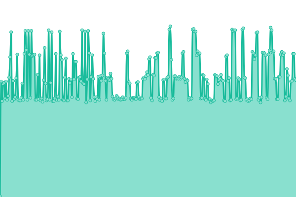 177ms
     
 | 

<a href="https://status.kabi.ai/history/taqa-api">100.00%</a>
    

|  [Ejada](https://ejada.hyrddbh.com/) | 游릴 Up | [ejada.yml](https://github.com/Aobeid96/kabistatus/commits/HEAD/history/ejada.yml) | 

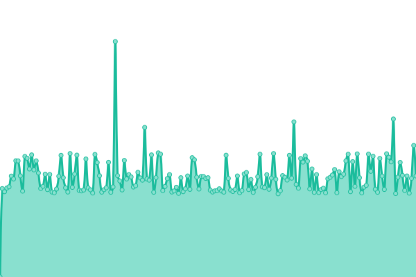 899ms
     
 | 

<a href="https://status.kabi.ai/history/ejada">100.00%</a>
    

|  [Ejada API](https://ejada.hyrddbh.com/api/health-check) | 游릴 Up | [ejada-api.yml](https://github.com/Aobeid96/kabistatus/commits/HEAD/history/ejada-api.yml) | 

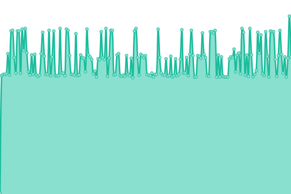 206ms
     
 | 

<a href="https://status.kabi.ai/history/ejada-api">100.00%</a>
    

|  [London](https://london.hyrdd.io/) | 游릴 Up | [london.yml](https://github.com/Aobeid96/kabistatus/commits/HEAD/history/london.yml) | 

 778ms
     
 | 

<a href="https://status.kabi.ai/history/london">100.00%</a>
    

|  [London API](https://london.hyrdd.io/api/health-check) | 游릴 Up | [london-api.yml](https://github.com/Aobeid96/kabistatus/commits/HEAD/history/london-api.yml) | 

 172ms
     
 | 

<a href="https://status.kabi.ai/history/london-api">100.00%</a>
    

|  [tokyo](https://tokyo.hyrdd.io/) | 游릴 Up | [tokyo.yml](https://github.com/Aobeid96/kabistatus/commits/HEAD/history/tokyo.yml) | 

 800ms
     
 | 

<a href="https://status.kabi.ai/history/tokyo">100.00%</a>
    

|  [tokyo API](https://tokyo.hyrdd.io/api/health-check) | 游릴 Up | [tokyo-api.yml](https://github.com/Aobeid96/kabistatus/commits/HEAD/history/tokyo-api.yml) | 

 178ms
     
 | 

<a href="https://status.kabi.ai/history/tokyo-api">100.00%</a>
    

|  [rio](https://rio.hyrdd.io/) | 游릴 Up | [rio.yml](https://github.com/Aobeid96/kabistatus/commits/HEAD/history/rio.yml) | 

 802ms
     
 | 

<a href="https://status.kabi.ai/history/rio">100.00%</a>
    

|  [rio API](https://rio.hyrdd.io/api/health-check) | 游릴 Up | [rio-api.yml](https://github.com/Aobeid96/kabistatus/commits/HEAD/history/rio-api.yml) | 

 178ms
     
 | 

<a href="https://status.kabi.ai/history/rio-api">100.00%</a>
    

|  [berlin](https://berlin.hyrdd.io/) | 游릴 Up | [berlin.yml](https://github.com/Aobeid96/kabistatus/commits/HEAD/history/berlin.yml) | 

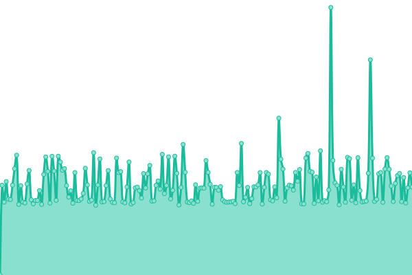 806ms
     
 | 

<a href="https://status.kabi.ai/history/berlin">100.00%</a>
    

|  [berlin API](https://rio.hyrdd.io/api/health-check) | 游릴 Up | [berlin-api.yml](https://github.com/Aobeid96/kabistatus/commits/HEAD/history/berlin-api.yml) | 

 178ms
     
 | 

<a href="https://status.kabi.ai/history/berlin-api">100.00%</a>
    

|  [tabukpharmaceuticals](https://tabukpharmaceuticals.hyrddsa.com/) | 游릴 Up | [tabukpharmaceuticals.yml](https://github.com/Aobeid96/kabistatus/commits/HEAD/history/tabukpharmaceuticals.yml) | 

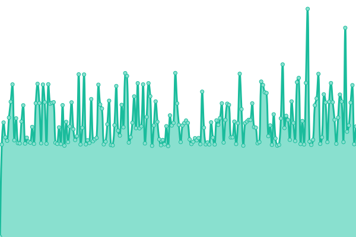 768ms
     
 | 

<a href="https://status.kabi.ai/history/tabukpharmaceuticals">100.00%</a>
    

|  [tabukpharmaceuticals API](https://tabukpharmaceuticals.hyrddsa.com/api/health-check) | 游릴 Up | [tabukpharmaceuticals-api.yml](https://github.com/Aobeid96/kabistatus/commits/HEAD/history/tabukpharmaceuticals-api.yml) | 

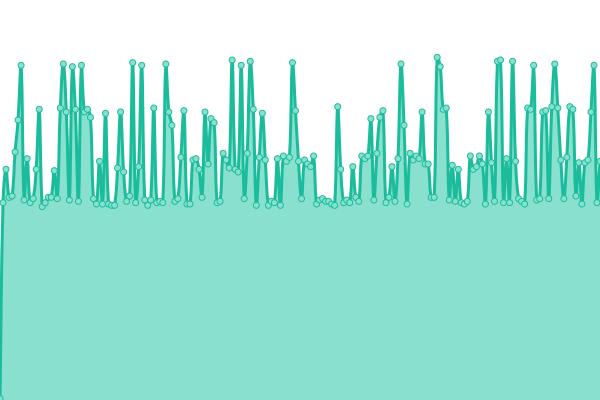 179ms
     
 | 

<a href="https://status.kabi.ai/history/tabukpharmaceuticals-api">81.76%</a>
    

|  [Riyadhcluster](https://careers.rfhc.gov.sa/) | 游릴 Up | [riyadhcluster.yml](https://github.com/Aobeid96/kabistatus/commits/HEAD/history/riyadhcluster.yml) | 

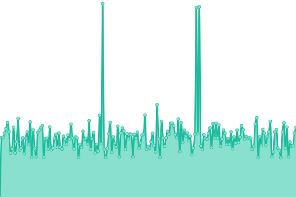 1858ms
     
 | 

<a href="https://status.kabi.ai/history/riyadhcluster">96.71%</a>
    

|  [Riyadhcluster API](https://careers.rfhc.gov.sa/api/health-check) | 游릴 Up | [riyadhcluster-api.yml](https://github.com/Aobeid96/kabistatus/commits/HEAD/history/riyadhcluster-api.yml) | 

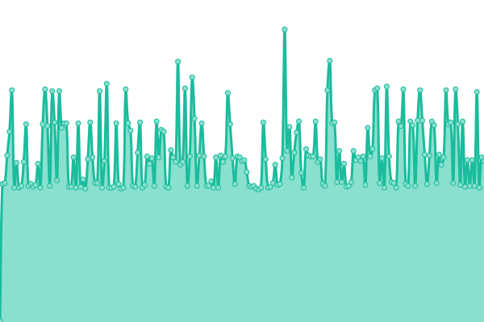 179ms
     
 | 

<a href="https://status.kabi.ai/history/riyadhcluster-api">96.72%</a>
    

|  [thiqah](https://careers.thiqah.sa/) | 游릴 Up | [thiqah.yml](https://github.com/Aobeid96/kabistatus/commits/HEAD/history/thiqah.yml) | 

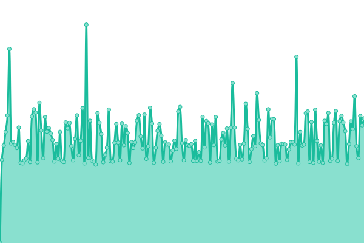 1069ms
     
 | 

<a href="https://status.kabi.ai/history/thiqah">100.00%</a>
    

|  [thiqah API](https://careers.thiqah.sa/api/health-check) | 游릴 Up | [thiqah-api.yml](https://github.com/Aobeid96/kabistatus/commits/HEAD/history/thiqah-api.yml) | 

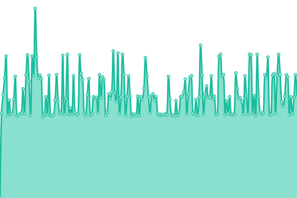 180ms
     
 | 

<a href="https://status.kabi.ai/history/thiqah-api">100.00%</a>
    

|  [tharwah](https://careers.tharwah.net/) | 游릴 Up | [tharwah.yml](https://github.com/Aobeid96/kabistatus/commits/HEAD/history/tharwah.yml) | 

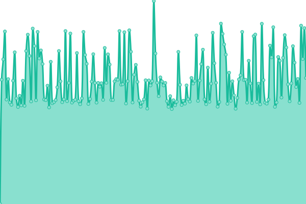 846ms
     
 | 

<a href="https://status.kabi.ai/history/tharwah">93.85%</a>
    

|  [tharwah API](https://careers.tharwah.net/api/health-check) | 游릴 Up | [tharwah-api.yml](https://github.com/Aobeid96/kabistatus/commits/HEAD/history/tharwah-api.yml) | 

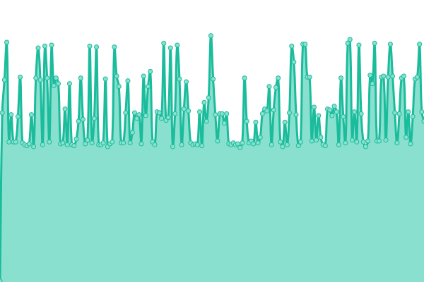 178ms
     
 | 

<a href="https://status.kabi.ai/history/tharwah-api">93.86%</a>
    

|  [SCISP](https://careers.scisp.gov.sa/) | 游릴 Up | [scisp.yml](https://github.com/Aobeid96/kabistatus/commits/HEAD/history/scisp.yml) | 

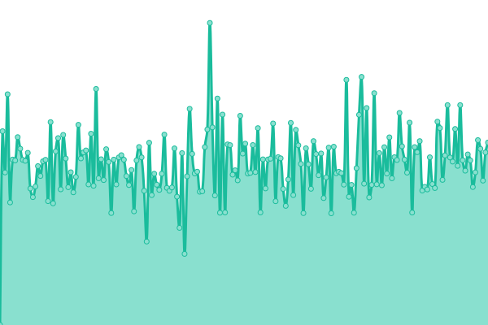 1711ms
     
 | 

<a href="https://status.kabi.ai/history/scisp">100.00%</a>
    

|  [SCISP API](https://careers.scisp.gov.sa/api/health-check) | 游릴 Up | [scisp-api.yml](https://github.com/Aobeid96/kabistatus/commits/HEAD/history/scisp-api.yml) | 

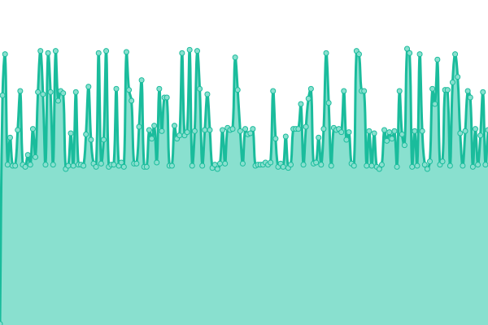 178ms
     
 | 

<a href="https://status.kabi.ai/history/scisp-api">100.00%</a>
    

|  [tdf](https://career.tdf.gov.sa/) | 游릴 Up | [tdf.yml](https://github.com/Aobeid96/kabistatus/commits/HEAD/history/tdf.yml) | 

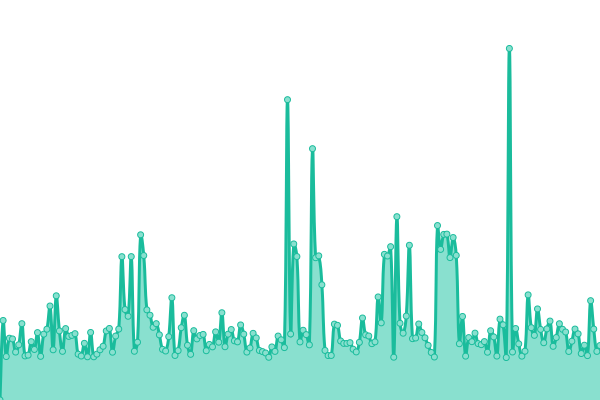 1102ms
     
 | 

<a href="https://status.kabi.ai/history/tdf">100.00%</a>
    

|  [tdf API](https://career.tdf.gov.sa/api/health-check) | 游릴 Up | [tdf-api.yml](https://github.com/Aobeid96/kabistatus/commits/HEAD/history/tdf-api.yml) | 

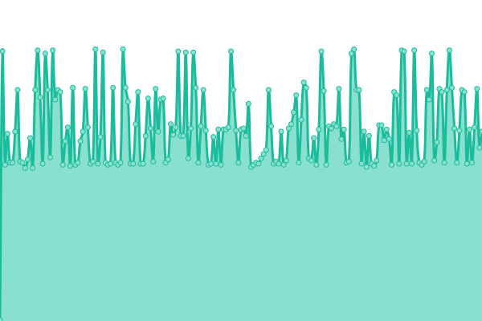 179ms
     
 | 

<a href="https://status.kabi.ai/history/tdf-api">100.00%</a>
    

|  [tadawul](https://tadawul.hyrddsa.com/) | 游릴 Up | [tadawul.yml](https://github.com/Aobeid96/kabistatus/commits/HEAD/history/tadawul.yml) | 

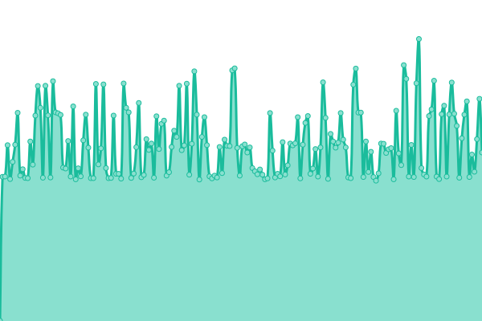 760ms
     
 | 

<a href="https://status.kabi.ai/history/tadawul">100.00%</a>
    

|  [tadawul API](https://tadawul.hyrddsa.com/api/health-check) | 游릴 Up | [tadawul-api.yml](https://github.com/Aobeid96/kabistatus/commits/HEAD/history/tadawul-api.yml) | 

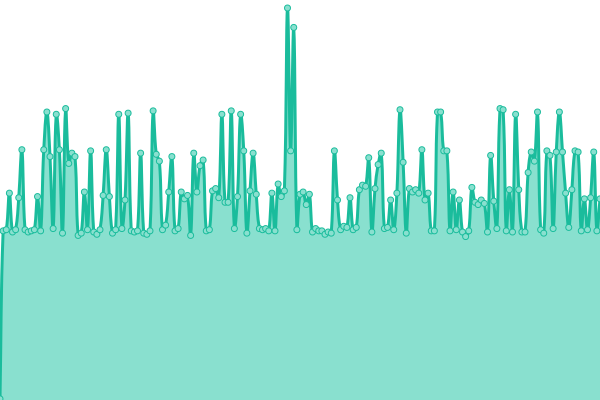 180ms
     
 | 

<a href="https://status.kabi.ai/history/tadawul-api">100.00%</a>
    

|  [SPARK](https://career.spark.sa/) | 游릴 Up | [spark.yml](https://github.com/Aobeid96/kabistatus/commits/HEAD/history/spark.yml) | 

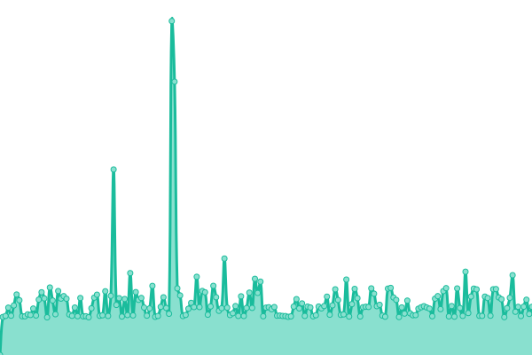 920ms
     
 | 

<a href="https://status.kabi.ai/history/spark">100.00%</a>
    

|  [SPARK API](https://career.spark.sa/api/health-check) | 游릴 Up | [spark-api.yml](https://github.com/Aobeid96/kabistatus/commits/HEAD/history/spark-api.yml) | 

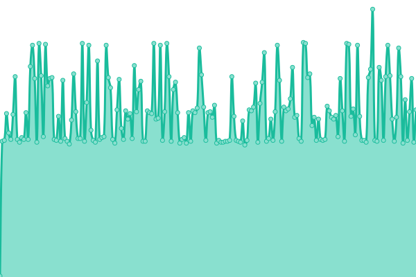 178ms
     
 | 

<a href="https://status.kabi.ai/history/spark-api">100.00%</a>
    

|  [Fahr](https://fahr.federaljobs.gov.ae/) | 游릴 Up | [fahr.yml](https://github.com/Aobeid96/kabistatus/commits/HEAD/history/fahr.yml) | 

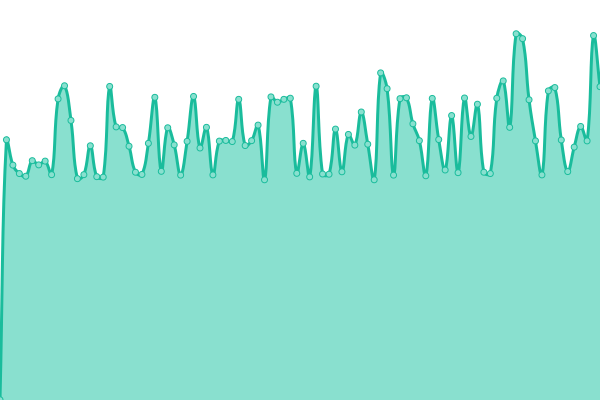 1145ms
     
 | 

<a href="https://status.kabi.ai/history/fahr">100.00%</a>
    

|  [TAQA](https://taqa.hyrddsa.com/) | 游릴 Up | [taqa.yml](https://github.com/Aobeid96/kabistatus/commits/HEAD/history/taqa.yml) | 

 751ms
     
 | 

<a href="https://status.kabi.ai/history/taqa">100.00%</a>
    

|  [TAQA API](https://taqa.hyrddsa.com/api/health-check) | 游릴 Up | [taqa-api.yml](https://github.com/Aobeid96/kabistatus/commits/HEAD/history/taqa-api.yml) | 

 177ms
     
 | 

<a href="https://status.kabi.ai/history/taqa-api">100.00%</a>
    

|  [Tadco](https://tadco.hyrddsa.com/) | 游릴 Up | [tadco.yml](https://github.com/Aobeid96/kabistatus/commits/HEAD/history/tadco.yml) | 

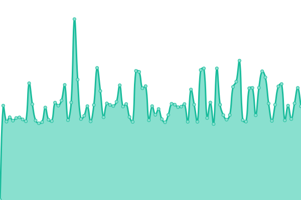 751ms
     
 | 

<a href="https://status.kabi.ai/history/tadco">100.00%</a>
    

|  [Tadco API](https://tadco.hyrddsa.com/api/health-check) | 游릴 Up | [tadco-api.yml](https://github.com/Aobeid96/kabistatus/commits/HEAD/history/tadco-api.yml) | 

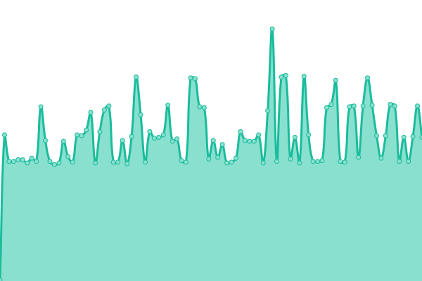 172ms
     
 | 

<a href="https://status.kabi.ai/history/tadco-api">100.00%</a>
    

|  [SMO](https://smo.hyrddsa.com/) | 游릴 Up | [smo.yml](https://github.com/Aobeid96/kabistatus/commits/HEAD/history/smo.yml) | 

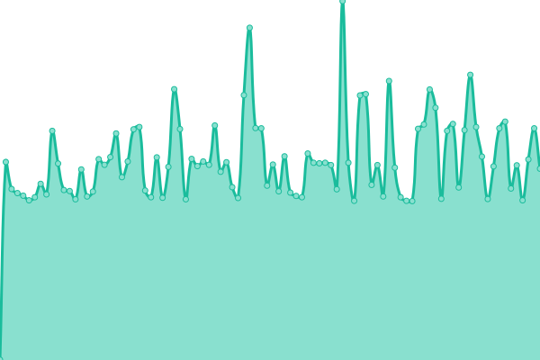 738ms
     
 | 

<a href="https://status.kabi.ai/history/smo">100.00%</a>
    

|  [SMO API](https://smo.hyrddsa.com/api/health-check) | 游릴 Up | [smo-api.yml](https://github.com/Aobeid96/kabistatus/commits/HEAD/history/smo-api.yml) | 

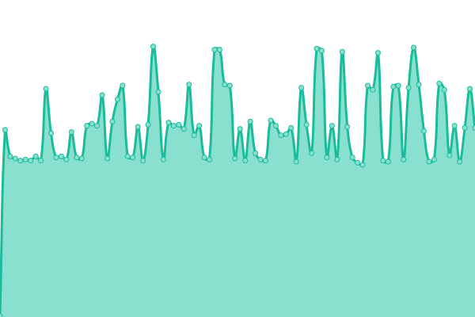 173ms
     
 | 

<a href="https://status.kabi.ai/history/smo-api">34.73%</a>
    

|  [Saudicatering](https://saudicatering.hyrddsa.com/) | 游릴 Up | [saudicatering.yml](https://github.com/Aobeid96/kabistatus/commits/HEAD/history/saudicatering.yml) | 

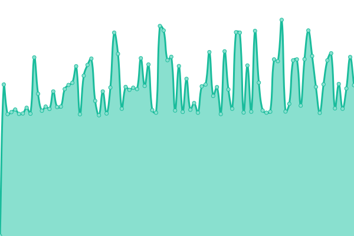 732ms
     
 | 

<a href="https://status.kabi.ai/history/saudicatering">100.00%</a>
    

|  [Saudicatering  API](https://saudicatering.hyrddsa.com/api/health-check) | 游릴 Up | [saudicatering-api.yml](https://github.com/Aobeid96/kabistatus/commits/HEAD/history/saudicatering-api.yml) | 

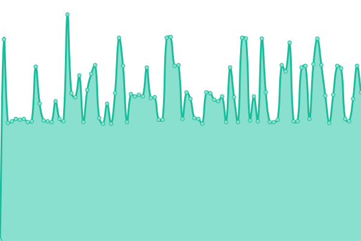 177ms
     
 | 

<a href="https://status.kabi.ai/history/saudicatering-api">100.00%</a>
    

|  [Kabi](https://career.kabi.jeddah.hyrdd.io/) | 游릴 Up | [kabi.yml](https://github.com/Aobeid96/kabistatus/commits/HEAD/history/kabi.yml) | 

 741ms
     
 | 

<a href="https://status.kabi.ai/history/kabi">100.00%</a>
    

|  [Kabi API](https://career.kabi.jeddah.hyrdd.io/api/health-check) | 游릴 Up | [kabi-api.yml](https://github.com/Aobeid96/kabistatus/commits/HEAD/history/kabi-api.yml) | 

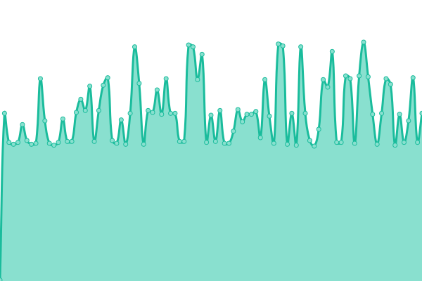 172ms
     
 | 

<a href="https://status.kabi.ai/history/kabi-api">100.00%</a>
    

|  [HRA](https://hra.hyrddbh.com/) | 游릴 Up | [hra.yml](https://github.com/Aobeid96/kabistatus/commits/HEAD/history/hra.yml) | 

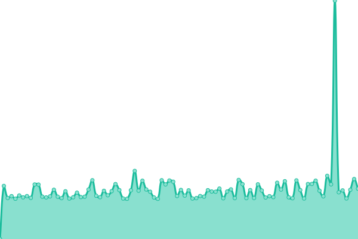 870ms
     
 | 

<a href="https://status.kabi.ai/history/hra">100.00%</a>
    

|  [HRA API](https://hra.hyrddbh.com/api/health-check) | 游릴 Up | [hra-api.yml](https://github.com/Aobeid96/kabistatus/commits/HEAD/history/hra-api.yml) | 

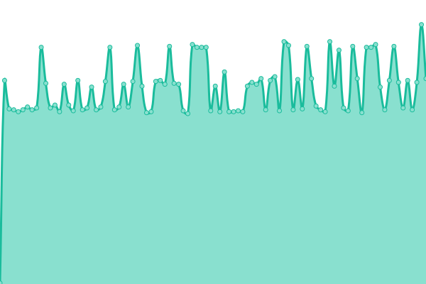 201ms
     
 | 

<a href="https://status.kabi.ai/history/hra-api">100.00%</a>
    

|  [Mewa](https://mewa.hyrddsa.com/) | 游릴 Up | [mewa.yml](https://github.com/Aobeid96/kabistatus/commits/HEAD/history/mewa.yml) | 

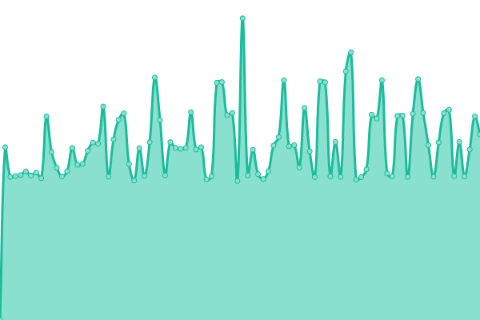 732ms
     
 | 

<a href="https://status.kabi.ai/history/mewa">61.17%</a>
    

|  [Mewa API](https://mewa.hyrddsa.com/api/health-check) | 游릴 Up | [mewa-api.yml](https://github.com/Aobeid96/kabistatus/commits/HEAD/history/mewa-api.yml) | 

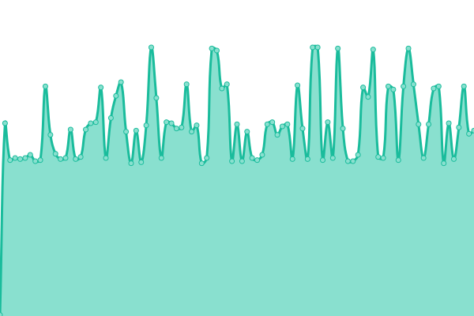 173ms
     
 | 

<a href="https://status.kabi.ai/history/mewa-api">100.00%</a>
    

|  [Tsfe](https://tsfe.hyrddbh.com) | 游릴 Up | [tsfe.yml](https://github.com/Aobeid96/kabistatus/commits/HEAD/history/tsfe.yml) | 

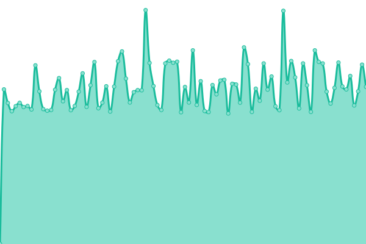 875ms
     
 | 

<a href="https://status.kabi.ai/history/tsfe">100.00%</a>
    

|  [Tsfe API](https://tsfe.hyrddbh.com/api/health-check) | 游릴 Up | [tsfe-api.yml](https://github.com/Aobeid96/kabistatus/commits/HEAD/history/tsfe-api.yml) | 

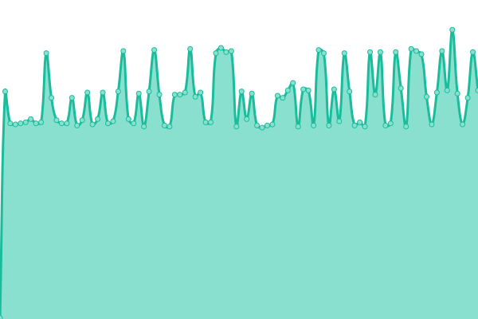 200ms
     
 | 

<a href="https://status.kabi.ai/history/tsfe-api">100.00%</a>
    

|  [KSMC](careers.ksmc.med.sa/) | 游린 Down | [ksmc.yml](https://github.com/Aobeid96/kabistatus/commits/HEAD/history/ksmc.yml) | 

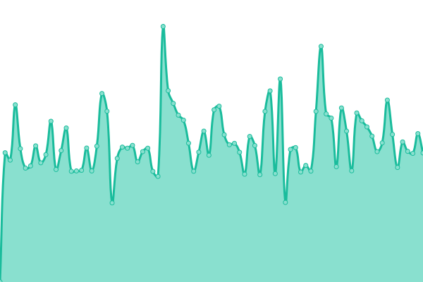 827ms
     
 | 

<a href="https://status.kabi.ai/history/ksmc">36.64%</a>
    

|  [KSMC API](careers.ksmc.med.sa/api/health-check) | 游린 Down | [ksmc-api.yml](https://github.com/Aobeid96/kabistatus/commits/HEAD/history/ksmc-api.yml) | 

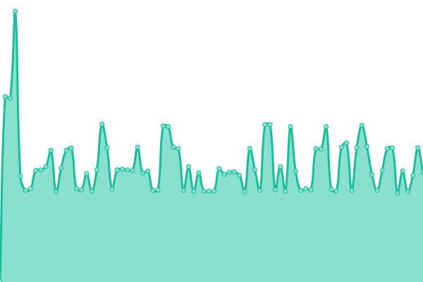 193ms
     
 | 

<a href="https://status.kabi.ai/history/ksmc-api">36.72%</a>
    

|  [Tkh](https://tkh.hyrddbh.com) | 游릴 Up | [tkh.yml](https://github.com/Aobeid96/kabistatus/commits/HEAD/history/tkh.yml) | 

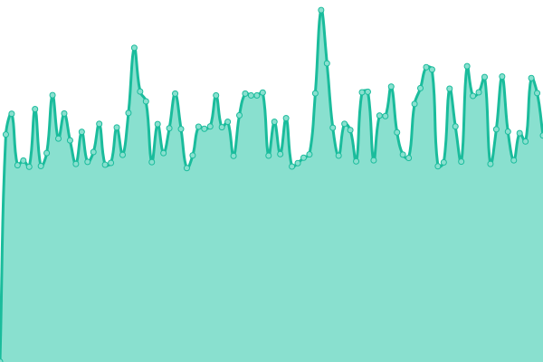 884ms
     
 | 

<a href="https://status.kabi.ai/history/tkh">100.00%</a>
    

|  [tkh API](https://tkh.hyrddbh.com/api/health-check) | 游릴 Up | [tkh-api.yml](https://github.com/Aobeid96/kabistatus/commits/HEAD/history/tkh-api.yml) | 

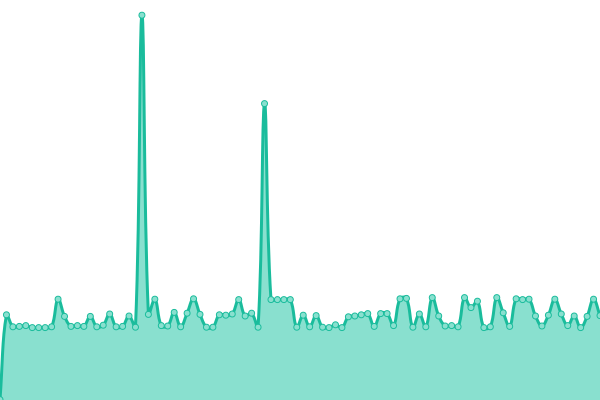 233ms
     
 | 

<a href="https://status.kabi.ai/history/tkh-api">100.00%</a>
    

<!--end: status pages-->

## 游늯 License

- Powered by: [Upptime](https://github.com/upptime/upptime)
- Code: [MIT](./LICENSE) 춸 [Upptime](https://upptime.js.org)
- Data in the `./history` directory: [Open Database License](https://opendatacommons.org/licenses/odbl/1-0/)
